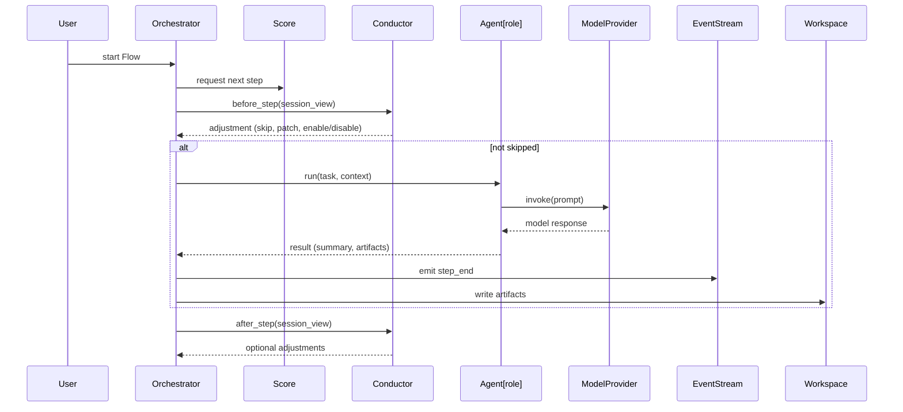

# Orket Architecture

Orket is a deterministic, multi‑agent orchestration engine.  
This document describes the system structure, runtime relationships, and the sequence of interactions that define a session.

---

# System overview

Orket coordinates a team of agents through a Flow. Each component has a focused responsibility:

- **Flow** — orchestration structure and references to Band, Venue, Score.  
- **Band** — role definitions and prompts.  
- **Venue** — model backend configuration and runtime parameters.  
- **Score** — ordered steps the Orchestrator executes.  
- **Conductor** — session governor that observes and adjusts between steps.  
- **Orchestrator** — runtime that loads configuration, runs steps, and records events.  
- **Agent** — role implementation that builds prompts and invokes a ModelProvider.  
- **ModelProvider** — abstraction that executes model invocations (local, mesh, or remote).  
- **Workspace** — files and artifacts produced by a run.  
- **Event Stream** — structured events for UI and auditing.

---

# Component relationships

    ┌──────────────┐
    │   Orchestrator│
    └───────┬──────┘
            │ builds
            ▼
    ┌──────────────┐        ┌──────────────────┐
    │    Agents     │ ───►  │  ModelProvider   │
    └──────────────┘        └──────────────────┘
            ▲
            │ uses
            ▼
    ┌──────────────┐
    │     Band      │
    └──────────────┘

- The **Orchestrator** constructs Agents from the Band and injects a ModelProvider.  
- Each **Agent** holds a reference to a ModelProvider and calls it directly to obtain model outputs.  
- The **Conductor** observes the session and provides adjustments to the Orchestrator between steps; it does not execute model calls itself.  
- The **Event Stream** receives structured events from the Orchestrator for UI and audit purposes.  
- The **Workspace** stores artifacts produced by Agents and the Orchestrator.

---

# Sequence diagram

The following Mermaid sequence diagram shows the interactions for a single step and the Conductor checks before and after the step.


---
## Filesystem Model

Orket defines three explicit filesystem spaces:

- **WorkDomain** — broad working area, usually the project root.
- **Workspaces** — isolated directories where agents write artifacts.
- **ReferenceSpaces** — read-only inputs.

Additionally:

- **The directory Orket is launched from is always readable (non-recursive).**

Access is controlled by a declarative policy:

```json
{
  "read_scope": ["workspace", "reference", "domain"],
  "write_scope": ["workspace"]
}

---

# Design principles

- **Visibility** — every decision, prompt, and output is recorded and inspectable.  
- **Control** — humans steer the session through the Conductor; automation is explicit and reversible.  
- **Composability** — roles, models, and flows are modular and replaceable.

These principles guide the architecture:

- Injected ModelProvider allows local, mesh, or remote backends without changing agent logic.  
- Deterministic orchestration and structured logs enable reproducibility and debugging.  
- The Conductor separates governance from execution, enabling both manual and automated interventions.

---

# Extensions and next steps

Planned directions that align with the core principles:

- UI dashboard that subscribes to the Event Stream and exposes Conductor controls.  
- Streaming model output and token accounting per role.  
- Automatic Conductor heuristics for drift detection and suggested adjustments.  
- Mesh ModelProvider for local cluster execution.  
- Session persistence and resume for long‑running work.
