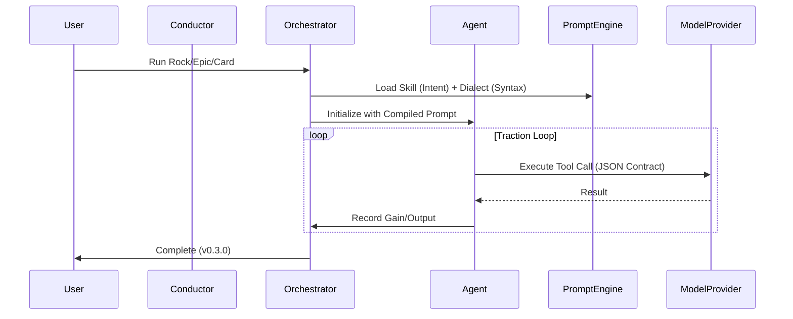

# Orket EOS Architecture (v0.3.0)

Orket is a multi‑agent orchestration engine built on the principles of **iDesign** (Juval Lowy).  
It decomposes system complexity by **volatility**, encapsulating areas of change within a hierarchy of Managers, Engines, and Accessors.

---

# The Project Hierarchy

Orket work is organized into a three-layer tree:

1.  **Rocks (The Strategic Layer):** High-level milestones or business objectives.
2.  **Epics (The Tactical Layer):** Functional groupings of tasks.
3.  **Cards (The Operational Layer):** Atomic units of execution with unique IDs (e.g., `COR26-0001`).

---

# The Prompt Engine (Volatility Decomposition)

To solve the "Leaf Node Explosion" (Role x Model x Version), Orket separates intent from syntax:

- **Skills (`/skills/*.json`):** Defines the **Managerial Intent**. These are high-level responsibilities and business goals. They are platform-agnostic.
- **Dialects (`/dialects/*.json`):** Defines the **Utility Syntax**. These capture how a specific model (e.g., Qwen, Llama) expects to see tool calls and formatting instructions.
- **The Compiler:** The `Agent` class dynamically compiles a **Skill** + a **Dialect** + **iDesign Constraints** into a single, high-precision system prompt at runtime.

---

# Component relationships (iDesign Model)

- **Managers (`orket/orket.py`):** Orchestrate the flow between Rocks, Epics, and Cards.
- **Engines (`orket/llm.py`, `orket/agents/agent.py`):** Handle the "intelligence" logic and prompt compilation.
- **Accessors (`orket/persistence.py`, `orket/vendors/`):** Manage state and external tool interactions (SQLite, Gitea, ADO).
- **Utilities (`orket/utils.py`, `orket/logging.py`):** Provide cross-cutting concerns like logging and name sanitization.

---

# iDesign Structural Training

Orket injects structural constraints into every technical agent, forcing code generation to follow a strict professional layout:

- `/controllers` — API/Entry points.
- `/managers` — Workflow orchestration.
- `/engines` — Business logic.
- `/accessors` — Tool/Data interaction.
- `/utils` — Cross-cutting logic.
- `/tests` — Automated verification.

---

# Sequence Diagram

---

# Vendor Abstraction

Orket defines a `VendorInterface` to allow plug-and-play integration with professional project management tools:
- **LocalVendor:** JSON-first local files (Default).
- **GiteaVendor:** Full REST API integration for local-first corporate meshes.
- **ADO/Jira:** Stubs for enterprise-grade vendor support.